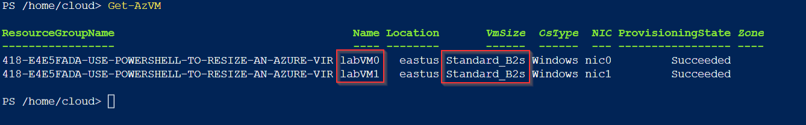
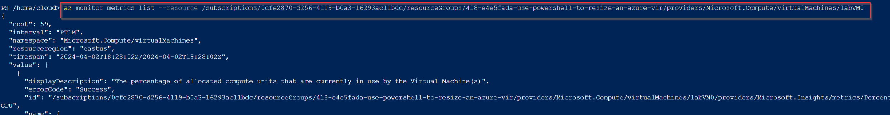
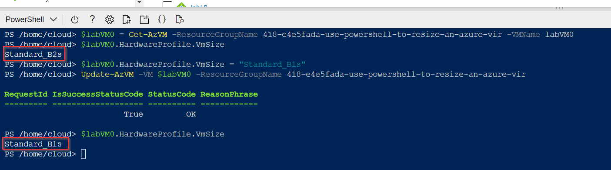
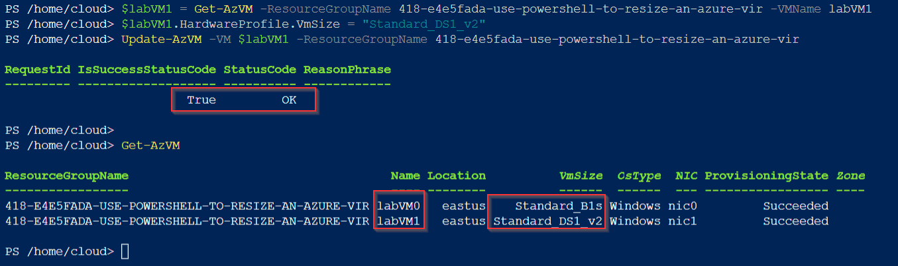

# Use PowerShell to Resize an Azure Virtual Machine in an Availability Set

**There are 3 objectives with this lab:**
* Start Cloud Shell
* Get the VM Size and CPU Metrics
* Resize VMs in Availability Set

## Start Cloud Shell

This part of the lab is self explanatory. I've gone over this step multiple times in different labs so very briefly, go to the Azure CLI, create a store account and file share, and then spin up PowerShell. 

That completes the start of the lab. On to the next objective. 

## Get the VM Size and CPU Metrics

Now, we need to get the information for the virtual machine (VM) sizes and the CPU metrics of each VM. In PowerShell, use `Get-AzVM` to see all the VMs in your resource group (RG) and their sizes. We only have two VMs, labVM0 and labVM1. By default, both VMs are  Standard B2s_sized. 

We can also get the CPU metrics of each VM by using the `az monitor metrics list` command. Honesty moment, I was struggle to use this command so I did get the complete command from the solution guide. You have to do this command both VMs to get their information. Here's the command for `labVM0`

That finishes up the second objective. On to the last one. 

## Resize VMs in Availability Set

We know need to get the commands to actually resize the VMs. I googled a website to get all of the commands ([link here](https://www.veeam.com/blog/resize-azure-vm-powershell.html)). If you want all of the commands I used, click on the Notepad file in this repository. But long story short, I created a variable for each VM. I think took the size parameter and changed it for each VM. Lastly, I updated the VM with the new size parameter. Here are the commands and verification for LabVM0

I resized labVM0 from Standard_B2s to Standard_B1s. 

I changed labVM1 to Standard_DS1_v2. Please note that in this lab, we only had a limited amount of options on what size we could choose so make sure you choose a permitted size. 

There's confirmation that both VMs were changed to a new size. 

Lab completed!

## Personal Notes

This lab was pretty easy as well. The hardest part was the CPU Metrics command. It wasn't working for me for some reason and I couldn't fix it solely from the PowerShell CLI error messages. It took a few minutes to figure out why the Update cmdlet wasn't accepting my argument. At first, I didn't have the right format and then I realized I couldn't choose that VM size as an option. Once I worked those two details out, I was able to run the commands just fine. Another win in the book!
